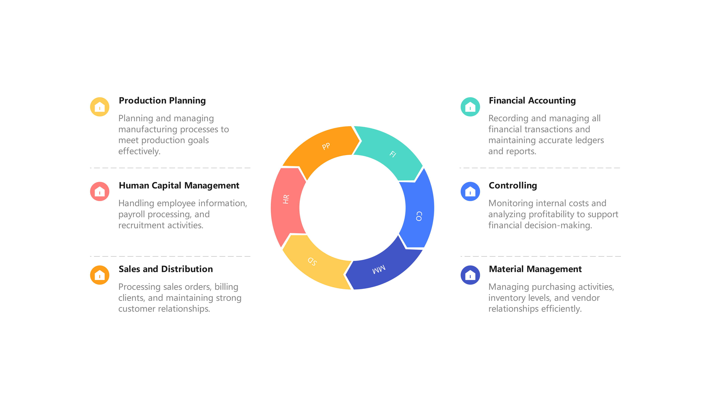

# Introduction to ERP

## From Manual Processes to ERP – Why Businesses Needed SAP

Manual business processes rely on paper, spreadsheets, emails, and disconnected tools to manage operations like sales, inventory, finance, and HR. While this traditional approach worked in small setups, it breaks down as organizations scale.

In a manual system, each department operates in isolation. For example, a sales team may record an order in Excel, while the inventory team tracks stock separately. There is no real-time synchronization, leading to data duplication and inconsistencies. Decision-making becomes slow because information is scattered and often outdated.

---

## Key Limitations of Manual Processes

- **Data Redundancy**  
  Same data entered multiple times across departments

- **Errors & Inaccuracy**  
  High risk of human mistakes in calculations and entries

- **Lack of Real-Time Data**  
  Delays in accessing updated business information

- **Poor Visibility**  
  Management cannot get a unified view of operations

- **Inefficiency**  
  Time-consuming tasks reduce productivity

- **Limited Scalability**  
  Difficult to handle growth and increased transactions

---

## Example Scenario

A company processes customer orders manually:

1. Sales records the order  
2. Sales emails inventory to check stock  
3. Inventory responds after some delay  
4. Finance creates the invoice separately  

This fragmented workflow leads to:
- Delays  
- Errors  
- Customer dissatisfaction  

---

## How ERP (SAP) Solves These Problems

ERP (Enterprise Resource Planning) systems like **SAP** integrate all business processes into a single system.

### Key Benefits:

- **Centralized Data Storage**  
  All data is stored in one place

- **Real-Time Updates**  
  Changes are instantly visible across departments

- **Process Integration**  
  Sales, inventory, finance, and HR work on the same platform

- **Improved Accuracy**  
  Reduces duplication and manual errors

- **Faster Decision-Making**  
  Management gets real-time insights

In simple terms, ERP replaces fragmented manual workflows with a **connected, automated, and scalable system**, enabling businesses to operate efficiently and grow without operational bottlenecks.

# ERP Products – The Backbone of Modern Enterprises

## Introduction

ERP (Enterprise Resource Planning) products are integrated software solutions that help organizations manage core business processes—such as finance, sales, inventory, procurement, and HR—on a single platform.

Instead of using multiple disconnected tools, ERP products unify operations and data across departments, enabling seamless collaboration and efficient decision-making.

---

## Popular ERP Products in the Market

- **SAP ERP / SAP S/4HANA**  
  Market leader; widely used by large enterprises

- **Oracle ERP Cloud**  
  Strong in finance and cloud-based solutions

- **Microsoft Dynamics 365**  
  Flexible and user-friendly for mid-sized businesses

- **Infor ERP**  
  Industry-specific solutions (manufacturing, healthcare)

- **Tally / Zoho ERP**  
  Common in small and medium businesses

---

## Key Characteristics of ERP Products

- **Integrated Modules**  
  Finance, Sales, HR, and Supply Chain work together seamlessly

- **Centralized Data**  
  Single source of truth across the organization

- **Real-Time Processing**  
  Instant updates across all departments

- **Standardized Processes**  
  Follows best industry practices

- **Scalability**  
  Supports business growth and increasing complexity

---

## Example Scenario

In an ERP system:

1. A sales order is created  
2. Inventory is automatically updated  
3. Finance receives billing details instantly  

This eliminates the need for manual coordination between teams and reduces delays and errors.

---

## Why SAP Stands Out

SAP is one of the most widely adopted ERP products globally due to:

- **Robust Architecture**  
  Handles complex business processes efficiently

- **High Scalability**  
  Suitable for small businesses to large enterprises

- **Industry Coverage**  
  Supports manufacturing, retail, banking, logistics, and more

- **Customization Capability**  
  Highly adaptable to specific business requirements

  ERP products act as the **digital backbone of an organization**, ensuring smooth, efficient, and integrated business operations while enabling better control, visibility, and scalability.

# Introduction to SAP and Its Modules – How Business Functions Connect

## Introduction

SAP (Systems, Applications, and Products in Data Processing) is a leading ERP software that integrates all business processes into one unified system. It enables organizations to manage operations like finance, sales, procurement, and HR using a single platform with real-time data.

SAP follows a modular architecture where each module represents a specific business function. These modules are interconnected and share the same database, ensuring seamless data flow across departments.

---

## Key SAP Modules

- **FI (Financial Accounting)**  
  Manages financial transactions, ledgers, and reporting

- **CO (Controlling)**  
  Handles internal cost tracking and profitability analysis

- **MM (Material Management)**  
  Covers procurement, inventory, and vendor management

- **SD (Sales and Distribution)**  
  Manages sales orders, billing, and customer processes

- **HR/HCM (Human Capital Management)**  
  Handles employee data, payroll, and recruitment

- **PP (Production Planning)**  
  Supports manufacturing and production processes

---

## Key Features of SAP

- **Integration**  
  All modules work together seamlessly

- **Real-Time Data**  
  Updates are reflected instantly across modules

- **Standardized Processes**  
  Built on global best practices

- **Customization**  
  Can be tailored to meet specific business requirements

---

## Example Scenario

When a sales order is created in the **SD module**:

1. Inventory is automatically updated in **MM**  
2. Financial entries are generated in **FI**  

This eliminates manual coordination between teams and ensures data consistency across the organization.

---

## Why This Matters for ABAP

ABAP developers play a critical role in SAP systems by:

- Building custom programs and reports  
- Enhancing standard SAP functionalities  
- Developing integrations and extensions  

These customizations help organizations align SAP with their unique business requirements.

# SAP Consultant Roadmap – Beginner to Professional

---

## Stage 1: Business & SAP Foundation

**Goal:** Understand business before SAP

- ERP basics and why SAP is used  
- Core processes: Sales, Procurement, Finance  
- SAP navigation (GUI / Fiori)  
- Organizational structure (Company Code, Plant)  

**Output:** Understand real business problems

---

## Stage 2: Choose Your Track

**Goal:** Pick ONE direction

- **Functional:** FI / MM / SD / HR (business + configuration)  
- **Technical:** ABAP (reports, interfaces, enhancements)  
- **Techno-functional:** Hybrid path (advanced)  

**Output:** Clear career identity

---

## Stage 3: Core Skills Development

**Goal:** Build working capability

- Configuration basics (IMG / SPRO)  
- Master data and data structures  
- Module integration  
- Debugging and issue analysis  
- Documentation (FS / TS)  

**Output:** Ready for project environment

---

## Stage 4: Integration & Real-World SAP

**Goal:** Understand system connectivity

- IDOC, RFC, APIs  
- OData and SAP Gateway  
- SAP BTP (basic)  
- End-to-end flow (Order → Invoice)  

**Output:** Think in systems, not modules

---

## Stage 5: Reporting & Analytics

**Goal:** Deliver business value

- ABAP Reports / CDS Views  
- SAP Analytics Cloud (basic)  
- KPIs and dashboards  
- Data interpretation  

**Output:** Answer business questions with data

---

## Stage 6: Project Lifecycle

**Goal:** Think like a consultant

- Requirement gathering  
- Testing (UT, IT, UAT)  
- Transport management  
- Cutover and go-live  

**Output:** Understand real SAP projects

---

## Stage 7: Professional Readiness

**Goal:** Become job-ready

- Resume and project portfolio  
- Interview preparation  
- Certification (optional)  
- Client communication  

**Output:** Ready for SAP roles

---

## Stage 8: Career Growth

**Goal:** Move to leadership

- Solution / Architect thinking  
- Cross-module expertise  
- Consulting and freelancing  

**Output:** High-value SAP professional

---

## Key Insight

**Depth > Breadth**

Real scenarios + strong business understanding = long-term success in SAP.

# Role of an ABAP Consultant in SAP Projects

## Overview

An ABAP Consultant is responsible for building and customizing technical solutions in SAP to support business requirements. They act as the bridge between functional teams (business side) and the SAP system.

---

## Key Responsibilities

- **Custom Development**  
  Create reports, interfaces, forms, and enhancements (RICEF objects)

- **Understanding Requirements**  
  Convert functional specifications (FS) into technical specifications (TS)

- **Data Handling**  
  Work with database tables, internal tables, and data processing logic

- **Integration Support**  
  Develop interfaces using IDOCs, RFCs, and APIs

- **Debugging & Issue Resolution**  
  Identify and resolve errors in existing programs

- **Performance Optimization**  
  Improve efficiency for large-scale data processing

---

## How ABAP Consultants Work in a Project

- Collaborate with functional consultants (FI/MM/SD, etc.)  
- Develop and test solutions based on business requirements  
- Support testing phases (Unit Testing, Integration Testing, UAT)  
- Assist during go-live and post-production support  

---

## Example Scenario

In a sales process:

- A client requires a custom invoice format  
- The ABAP consultant develops a **Smart Form** or **Adobe Form**  
- The solution is integrated with the billing process  

This ensures the output meets business and regulatory requirements.

---

## Key Perspective

ABAP consultants build the **technical backbone of SAP applications**, enabling business processes to run efficiently through customized and optimized solutions.

# Role of an ABAP Consultant in Object Development

## Overview

In SAP projects, object development refers to creating technical components (RICEF: Reports, Interfaces, Conversions, Enhancements, Forms). The ABAP Consultant is responsible for designing, building, and delivering these objects based on business needs.

---

## Key Responsibilities in Object Development

- **Requirement Analysis**  
  Understand Functional Specification (FS) and clarify gaps

- **Technical Design**  
  Prepare Technical Specification (TS) including logic, tables, and process flow

- **Development**  
  Build objects using ABAP (reports, forms, interfaces, etc.)

- **Unit Testing**  
  Test developed objects with multiple business scenarios

- **Code Quality**  
  Follow naming standards, performance guidelines, and reusable design principles

- **Documentation**  
  Maintain technical documentation and test evidence

---

## Types of Objects Developed

- **Reports**  
  Data extraction and display (e.g., ALV reports)

- **Interfaces**  
  Data exchange using IDOCs, RFCs, and APIs

- **Conversions**  
  Data migration programs (e.g., LSMW, BDC)

- **Enhancements**  
  Extend standard SAP without modifying core code (BADI, User Exit)

- **Forms**  
  Smart Forms / Adobe Forms for outputs like invoices

---

## Example Scenario

A company requires a custom report to track delayed deliveries:

- Business requirement is analyzed  
- Relevant tables and logic are identified  
- Data is fetched and processed using ABAP  
- Output is presented using an ALV report with filters and layout  

This enables better monitoring and decision-making for operations.

---

## Key Perspective

ABAP consultants translate business requirements into reliable SAP functionalities by designing and developing efficient technical objects aligned with system standards.