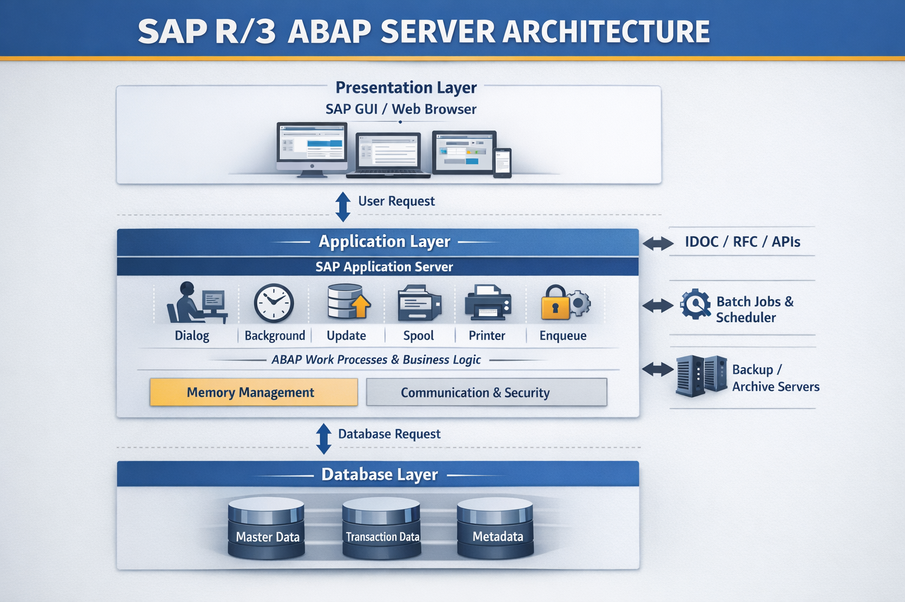
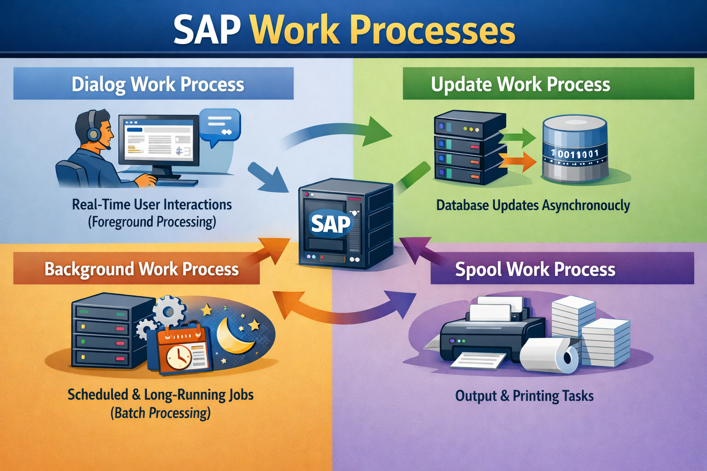

# SAP R/3 ARCHITECTURE

# SAP Application Server Services – The Core Engine of ABAP Execution

## Overview

The SAP Application Server is the central layer where ABAP programs run and business logic is processed. It sits between the presentation layer (user interface) and the database, ensuring smooth execution of SAP applications.

---

## Key Services Provided

- **Program Execution**  
  Runs ABAP reports, transactions, and background jobs

- **Work Process Management**  
  Handles different types of processing tasks within the system

- **Memory Management**  
  Manages user sessions and program data during execution

- **Communication Handling**  
  Connects users to the system and manages incoming requests

- **Security & Authorization**  
  Ensures only authorized users can access system data

---

## Types of Work Processes

- **Dialog Work Process**  
  Handles real-time user interactions (foreground processing)

- **Update Work Process**  
  Processes database updates asynchronously

- **Background Work Process**  
  Executes scheduled or long-running jobs (batch processing)

- **Spool Work Process**  
  Manages output and printing tasks

---

## How It Works

1. User sends a request (e.g., execute a report or transaction)  
2. Request is received by the application server  
3. ABAP logic is processed in a work process  
4. Data is fetched or updated in the database  
5. Result is sent back to the user interface  

---

## Example Scenario

When a user creates a sales order:

- The request is handled by a **dialog work process**  
- Business logic is executed in the application server  
- Data is updated via **update work processes**  
- Confirmation is returned to the user instantly  

---

## Key Perspective

The SAP Application Server is the execution engine of SAP, responsible for processing requests, managing workloads, and ensuring efficient business operations.

# SAP R/3 Landscape – How SAP Systems Are Organized

## Overview

SAP R/3 Landscape refers to the system setup used to develop, test, and run SAP applications in a controlled and structured way. It ensures that changes are properly validated before reaching end users.

---

## Typical SAP Landscape

- **Development (DEV)**  
  Where developers write and modify ABAP code

- **Quality (QA / QAS)**  
  Testing environment for validating changes

- **Production (PRD)**  
  Live system used by business users

---

## Key Concepts

- **Transport System**  
  Moves objects (programs, tables, configurations) from DEV → QA → PRD

- **System Isolation**  
  Each system has a specific role to minimize risk

- **Version Control**  
  Ensures only tested and approved changes are deployed

- **Client Concept**  
  Multiple clients exist within a system for different purposes (e.g., testing, training)

---

## How It Works

1. Developer creates or modifies an object in DEV  
2. A transport request is generated  
3. Object is moved to QA for testing and validation  
4. After approval, it is transported to PRD  

---

## Example Scenario

A new sales report is:

- Developed in **DEV**  
- Tested in **QA** by functional teams and business users  
- Deployed to **PRD** for live usage  

This ensures stability and reliability in the production environment.

---

## Why It Matters

- Prevents errors in the live system  
- Ensures quality and stability of changes  
- Supports structured and controlled project delivery  

---

## Key Perspective

SAP R/3 Landscape acts as a controlled pipeline that ensures all changes are validated, approved, and safely deployed to the production system.

# Client Concept in SAP – Logical Separation of Business Data

## Overview

In SAP, a client is a logical unit within a system that stores its own data, users, and configurations. Multiple clients can exist in the same SAP system, but each operates like an independent environment.

---

## Key Characteristics

- **Independent Data**  
  Each client has separate master data and transactional data

- **User Management**  
  Users and authorizations are maintained at the client level

- **Customizing Settings**  
  Configuration can vary across clients

- **Shared System**  
  Same technical system, but logically separated environments

---

## Types of Clients

- **Development Client**  
  Used for configuration, development, and initial testing

- **Testing Client**  
  Used for validation, integration testing, and UAT

- **Production Client**  
  Used for live business operations

---

## Client-Dependent vs Client-Independent

- **Client-Dependent Data**  
  Data specific to a client (e.g., master data, transactional data)

- **Client-Independent Data**  
  Shared across all clients (e.g., programs, repository objects)

---

## How It Works

1. User logs in with a specific client number (e.g., 100, 200, 300)  
2. System loads data and configurations specific to that client  
3. All operations are restricted within that client’s environment  

---

## Example Scenario

A company may use:

- Client **100** for development  
- Client **200** for testing  
- Client **300** for production  

All within the same SAP system, ensuring controlled separation of environments.

---

## Why It Matters

- Enables safe testing without impacting live data  
- Supports multiple environments within a single system  
- Ensures data security and logical separation  

---

## Key Perspective

A client acts as an isolated business environment within SAP, allowing organizations to manage development, testing, and production activities in a controlled and structured manner.

