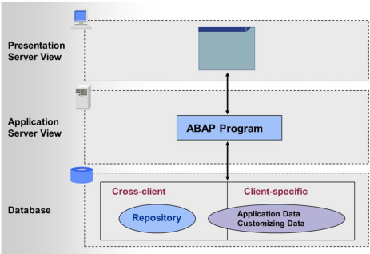

# ABAP Workbench 

## ABAP Repository 

The ABAP Repository, also known as the SAP Repository, is a central database that stores all development objects created using the ABAP Workbench in the SAP system. It plays a crucial role in the development and maintenance of SAP applications by providing a structured and organized environment for managing various types of development artifacts. Here are the key aspects of the ABAP Repository:

1. **Central Store for Development Objects**: It contains all ABAP workbench development objects, such as programs, function modules, classes, and more. \[[Read More..](https://www.stechies.com/difference-bw-data-dictionary-data-repository/)\]

2. **Cross-Client Nature**: The repository is cross-client, meaning it is accessible from any client within the SAP system, ensuring consistency and reuse of development objects across different environments. \[[Read More..](https://www.stechies.com/difference-bw-data-dictionary-data-repository/)\]

3. **Support for SAPUI5**: The repository also stores SAPUI5 applications, components, and libraries, using BSP (Business Server Pages) applications to handle text files, page fragments, and other resources. \[[Read More..](https://sapui5.hana.ondemand.com/sdk/docs/topics/5a814d9945d148b0a1ad941791c3c723.html)\]

4. **Data Structuring**: It transforms unstructured information into a structured form, facilitating efficient data management and retrieval. \[[Read More](https://community.sap.com/t5/technology-q-a/what-is-mean-by-repository/qaq-p/4082636\]

Overall, the ABAP Repository is essential for the effective management of development objects and resources in the SAP ecosystem, enabling developers to build and maintain robust business applications.
