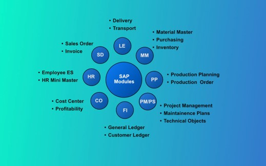

# ABAP Workbench 

## ABAP Repository 

The ABAP Repository, also known as the SAP Repository, is a central database that stores all development objects created using the ABAP Workbench in the SAP system. It plays a crucial role in the development and maintenance of SAP applications by providing a structured and organized environment for managing various types of development artifacts. Here are the key aspects of the ABAP Repository:

1. **Central Store for Development Objects**: It contains all ABAP workbench development objects, such as programs, function modules, classes, and more. \[[Read More..](https://www.stechies.com/difference-bw-data-dictionary-data-repository/)\]

2. **Cross-Client Nature**: The repository is cross-client, meaning it is accessible from any client within the SAP system, ensuring consistency and reuse of development objects across different environments. \[[Read More..](https://www.stechies.com/difference-bw-data-dictionary-data-repository/)\]

3. **Support for SAPUI5**: The repository also stores SAPUI5 applications, components, and libraries, using BSP (Business Server Pages) applications to handle text files, page fragments, and other resources. \[[Read More..](https://sapui5.hana.ondemand.com/sdk/docs/topics/5a814d9945d148b0a1ad941791c3c723.html)\]

4. **Data Structuring**: It transforms unstructured information into a structured form, facilitating efficient data management and retrieval. \[[Read More](https://community.sap.com/t5/technology-q-a/what-is-mean-by-repository/qaq-p/4082636\]

Overall, the ABAP Repository is essential for the effective management of development objects and resources in the SAP ecosystem, enabling developers to build and maintain robust business applications.

--- 

## ABAP Repository Objects 

 

ABAP Repository Objects are development objects stored in an SAP system's database, used for creating and managing various SAP applications. These objects are integral to the ABAP Workbench and are managed via the Change and Transport System. Here are some key points about ABAP Repository Objects:

1. **Types of Repository Objects**: They include programs, function modules, classes, tables, views, and data dictionary elements like domains and data elements. \[[Sap Doc 1](https://help.sap.com/doc/abapdocu_751_index_htm/7.51/en-us/abenrepository_object_glosry.htm#:~:text=Repository%20objects%20are%20development%20objects,the%20Change%20and%20Transport%20System.)\], \[[Sap Community](https://community.sap.com/t5/application-development-discussions/difference-between-repository-objects-database-objects/td-p/4002437)\]

3. **Purpose and Usage**: Repository objects are used for development within the SAP environment, facilitating the creation, modification, and management of SAP applications and custom developments. \[[SAP Basis Solutions](https://sapbasissolutions.wordpress.com/2019/03/26/difference-between-repository-objects-database-objects/)\].

4. **Organization and Management**: These objects are organized and stored in a structured manner within the SAP system. They are managed through the ABAP Workbench tools and can be transported across different SAP systems using the Change and Transport System. \[[Sap Docs](https://help.sap.com/doc/abapdocu_751_index_htm/7.51/en-us/abenrepository_object_glosry.htm#:~:text=Repository%20objects%20are%20development%20objects,the%20Change%20and%20Transport%20System.)\]

5. **Examples**: Common examples of repository objects include ABAP programs, classes, interfaces, function groups, and dictionary objects like tables and views. \[[SAP File Format - Github](https://github.com/SAP/abap-file-formats/blob/main/docs/glossary.md)\]

6. **Difference from Database Objects**: While repository objects include development objects like programs and dictionary definitions, database objects specifically refer to the physical database tables and views that store data. \[[SAP Community](https://community.sap.com/t5/application-development-discussions/difference-between-repository-objects-database-objects/td-p/4002437)\].

 

_SAP Easy Access menu, choose Tools→ ABAP Workbench→ Overview→ Information System._

