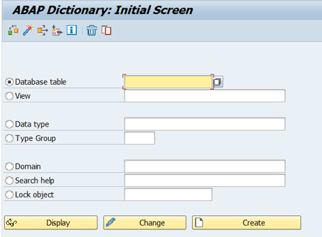
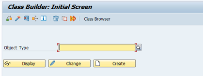

# SAP-ABAP
 SAP ABAP on Hana Repository

## History of SAP. 

## Introduction to ABAP. 

> ABAP, which stands for Advanced Business Application Programming, is a high-level programming language created by SAP for developing business applications in the SAP environment. 

Here are some key points about ABAP:

- _Multi-Paradigm Language: _ABAP supports procedural, object-oriented, and other programming paradigms, making it versatile for various programming needs.
- _Purpose: _It is primarily used for developing applications in SAP R/3 and S/4HANA systems, including custom reports, interfaces, conversions, enhancements, and forms.
- _Integration with SAP:_ ABAP is tightly integrated with SAP's database and application environment, enabling seamless development of applications that can interact directly with the SAP data and processes.
-_ ABAP Objects:_ The introduction of ABAP Objects brought object-oriented programming capabilities to ABAP, allowing for more modular, reusable, and maintainable code.
- _Development Tools:_ Development in ABAP is typically done using the ABAP Workbench, which provides various tools for coding, debugging, and performance analysis.

ABAP remains a critical skill for SAP professionals, particularly those involved in custom development and system enhancement.

| Topic                               | Links                                                                                                                                   |
|-------------------------------------|-----------------------------------------------------------------------------------------------------------------------------------------|
| History of SAP                      | [Link to the official page](https://www.sap.com/india/about/company/history.html)                                                       |
| Evolution of ABAP                   | [Link to the official page](https://community.sap.com/t5/enterprise-resource-planning-blogs-by-sap/evolution-of-abap/ba-p/13522761)     |
| Evolution of ABAP Programming Model | [Link to the official page](https://community.sap.com/t5/technology-blogs-by-sap/evolution-of-the-abap-programming-model/ba-p/13398328) |

---

## ERP Architecture

1. **Database Layer**

This is the central repository where all business data is stored. The database layer ensures data consistency and real-time access to data across the organization. It supports the various modules of the ERP system by providing a unified and integrated set of data that can be used for reporting, analysis, and operational purposes.

2. **Application Layer**

This layer hosts the actual ERP applications that process business transactions and manage data operations. It includes various functional modules such as finance, human resources, manufacturing, supply chain management, and customer relationship management. Each module is designed to support specific business functions and processes.

3. **Presentation Layer**

This is the user interface of the ERP system where users interact with the software. The presentation layer can vary widely, ranging from traditional graphical user interfaces (GUIs) like SAP GUI to modern web-based interfaces such as SAP Fiori. This layer is crucial for ensuring user accessibility and usability.

4. **Middleware**

Middleware in ERP architecture helps integrate diverse systems and applications across the enterprise. It enables communication between the ERP system and other independent systems, ensuring that there is seamless data flow and functionality across platforms. Middleware can include integration tools, application servers, and APIs.

---

## SAP Architecture

1. **Database Layer:**

The underlying database system where all data is stored. SAP ABAP is designed to work with any database but is optimized for SAP HANA, which allows leveraging advanced features like in-memory computing.

2. **Application Server ABAP (AS ABAP):**

This is the core of ABAP architecture, consisting of the application servers and the message server. These servers handle the execution of ABAP programs, the processing of client requests, and the management of database communications.

3. **Presentation Layer**

This consists of the client-side components that interact with the SAP system, typically SAP GUI or newer web-based interfaces like SAP Fiori. This layer is responsible for presenting the user interface to end users.

4. **Middleware**

- _Central Services:_ This includes the central services instance (ASCS), which provides essential services like enqueue and message services, vital for the management of locks and cross-application messaging.

- _Application Server ABAP (AS ABAP):_ This is the core of ABAP architecture, consisting of the application servers and the message server. These servers handle the execution of ABAP programs, the processing of client requests, and the management of database communications.

---

## SAP Module 

SAP modules are distinct functional components of the SAP ERP system that target specific business areas and processes. Each module is designed to handle specific business functions like finance, sales, human resources, and operations, enabling organizations to manage and integrate their business processes efficiently. 

Here are some of the main SAP modules:

- **SAP Financial Accounting (FI):** Manages a company's financial transactions and reporting, ensuring compliance with accounting regulations.

- **SAP Controlling (CO):** Supports monitoring, coordination, and optimization of all processes in an organization.

- **SAP Sales and Distribution (SD):** Handles all aspects of sales and distribution processing, including selling, shipping, billing, and invoicing.

- **SAP Material Management (MM):** Manages materials procurement and inventory functions, including purchasing, inventory, and warehouse management.

- **SAP Human Capital Management (HCM):** Focuses on personnel administration, payroll, recruiting, and workforce management.

---

## RICEF 

> RICEF is an acronym used within SAP environments to categorize different types of development work required to enhance or customize the standard SAP system to meet specific business needs

Each letter in "RICEF" stands for a particular type of object or development task:

**R - Reports:** These are programs or tools that generate lists or other outputs based on the data within the SAP system. Reports are crucial for business analysis and decision-making processes, often created using ABAP programming.

**I - Interfaces:** Interfaces refer to the connections set up between the SAP system and external systems or between different SAP systems. These are crucial for data exchange and are often developed using various methods including BAPIs (Business Application Programming Interfaces), RFCs (Remote Function Calls), and IDocs (Intermediate Documents).

**C - Conversions:** Conversions involve the migration of data from legacy systems into an SAP environment, which is essential during initial SAP setup or when integrating new modules. This typically involves data mapping and transformation scripts.

**E - Enhancements:** Enhancements are modifications or additions to the standard SAP system to meet specific business requirements without altering the core software. This can be achieved through user exits, BADIs (Business Add-Ins), and enhancement spots.

**F - Forms:** Forms are templates used for the output of data in a structured and formatted way, such as invoices, purchase orders, and checks. SAP Script and Smart Forms are common technologies used to design and implement forms.

---

## T-Codes

SAP ABAP Transaction Codes, commonly known as T-Codes, are standardized shortcuts or codes used to access specific tasks or transactions within the SAP system without using a navigation menu. Each T-Code in SAP is associated with a particular task; these can be operational tasks, such as entering a sales order, or administrative tasks, such as accessing user data or system settings.

Here’s how T-Codes are typically used in SAP:

- **Direct Access:** Instead of navigating through several menus to reach a particular function, users can enter a T-Code in the command field to access it directly.

- **Shortcuts:** T-Codes serve as shortcuts to transactions, saving time and effort in daily operations.

- **Functional Classification:** T-Codes are grouped by related functions, such as finance, human resources, or materials management, making them easier to learn and remember.

> NOTE: You can Create a T-Code in SE93, The list of T-Codes can be seen in TSTC Table.

### ABAP centric T-Codes

| T-Code                           | Description                                  |
|----------------------------------|----------------------------------------------|
| ABAPDOCU                         | Example Library                              |
| ABAPHELP                         | Keyword Documentation                        |
| SE80                             | Object Navigator                             |
| SE93                             | Maintain Transaction                         |
| SE37                             | ABAP Function Modules                        |
| SE38                             | ABAP Editor                                  |
| [SE11](##Data Dictionary - SE11) | Data dictionary maintenance                  |
| SE09                             | Transport organizer                          |
| SLIN                             | Extended Check                               |
| SM30                             | Maintain tables(not all tables can use SM30) |
| ST22                             | Dump Analysis                                |
| SU53                             | Display authorization checked values         |
| SE24                             | ABAP Classes                                 |
| SCI                              | Code Inspector                               |
| SE01                             | Transport Organizer(Extended View)           |

### Other ABAP T-Codes

| T-Code     | Description                                                                       |
| ---------- | --------------------------------------------------------------------------------- |
| SE41       | Menu Painter                                                                      |
| SE51       | Screen Painter                                                                    |
| SE71       | Form Painter                                                                      |
| SM50       | Work process overview                                                             |
| SM59       | RFC connection, maintain                                                          |
| ST01       | SAP system trace                                                                  |
| SM21       | System Log                                                                        |
| SE72       | SAPscript Styles                                                                  |
| SE73       | SAPscript Font Maintenance                                                        |
| SE74       | SAPscript format conversion                                                       |
| SE75       | SAPscript Settings                                                                |
| SE76       | SAPscript: Form Translation                                                       |
| SE77       | SAPscript Styles Translation                                                      |
| smartforms | Smartforms                                                                        |
| Wedi       | IDOC and EDI basis                                                                |
| we31       | Segment creation                                                                  |
| we30       | Idoc Type creation                                                                |
| we81       | Creation and assigning of Message type                                            |
| NACE       | conditions of output control (to create a link between forms and driver programs) |

### ABAP T-Codes related to Basis

| T-Code | Description                                       |
| ------ | ------------------------------------------------- |
| SPAD   | Spool administration (printer setup)              |
| SPAU   | Intersection SAP Transport/customer modifications |

---

## Data Dictionary - SE11

> The ABAP Data Dictionary is a central and integral component of the SAP system. It is used for defining and managing metadata (data about data). The Data Dictionary provides a way to manage database objects like tables, views, and types, among others, centrally. This system component ensures data consistency, data integrity, and optimizes data access by managing the database definitions of these objects.

**Functions of the ABAP Data Dictionary:**

- **Data Integrity:** Enforces data validation rules through domains and data elements to ensure the accuracy and integrity of data stored in the system.

- **Data Management:** Provides tools to create and manage database schema objects such as tables, indexes, and foreign keys. This management is abstracted from the physical database layer.

- **Data Integration:** Ensures that all applications use a consistent data model, which is crucial for integration across different modules of SAP.

- **Performance Optimization:** Contains buffer settings for tables and helps in optimizing data access paths through secondary indexes.

- **Centralized Control:** Offers a centralized location to manage all metadata, which simplifies tasks like data migration, system upgrades, or changes in the database layout.

**Key Components of the ABAP Data Dictionary:**

- **Tables:** These are the fundamental objects where data is stored. Tables in the Data Dictionary are defined independently of the database. Types of tables include transparent tables (directly correspond to a database table), pool tables, and cluster tables.

- **Data Elements:** These describe the individual fields in the tables. Data elements include technical and descriptive information such as data type, length, decimal places, and a short text description.

- **Domains:** Domains define the attributes of data fields, such as value range, data type, and length. They are used to ensure that data entered into the fields conforms to predefined criteria, aiding in data consistency and validation.

- **Views:** Views are virtual tables derived from one or more tables. Views are used to generate reports or retrieve data in a format that does not directly correspond to the structure of the underlying database.

- **Search Helps:** These are tools for searching the database. They help users to find possible input values for fields in database tables. Search helps can be attached to fields via their data element descriptions.

- **Lock Objects:** Lock objects are used to synchronize access to database entries when several users attempt to access the same data simultaneously. They help manage concurrent access, ensuring that transaction integrity is maintained.

- **Type Groups:** Type groups (Type Pools) contain definitions of data types that are reusable across programs.

---

## Object Oriented Programming – SE24

> **Object-Oriented Programming (OOP)** in SAP ABAP introduces a modern approach to programming that complements the traditional procedural programming techniques. The primary goal of incorporating OOP in ABAP is to enhance reusability, maintainability, and scalability of code, which are crucial for complex SAP software development. ABAP’s OOP extension is particularly powerful for developing SAP applications that are easy to adjust, extend, and maintain. It integrates seamlessly with traditional ABAP programming, providing a robust toolset for addressing contemporary software development challenges in the SAP ecosystem.

Advantages of Using OOP in ABAP:

- **Enhanced Code Quality:** OOP makes ABAP programs more systematic and manageable, which is especially beneficial in complex system developments.

- **Modularity:** Encourages modular design by allowing programmers to build components that can be developed independently and plugged in as needed.

- **Reusability:** Enables developers to use the same object in different programs, reducing redundancy and effort.

- **Ease of Maintenance:** Changes made in a class are inherited by all its subclasses, which simplifies updates and maintenance.

